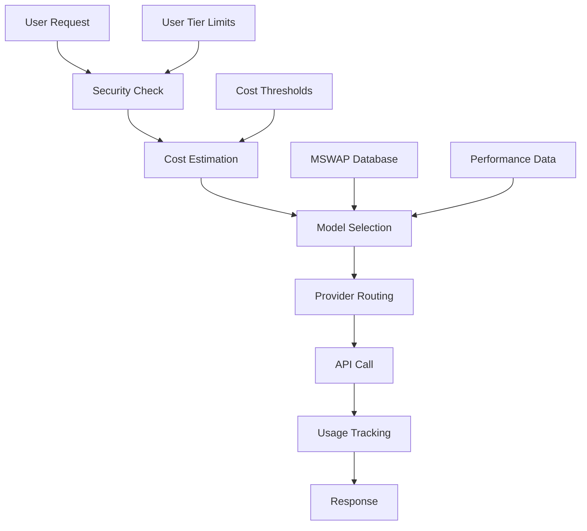

# ChatChonk - AI-Powered Knowledge Processing Platform

> **“Tame the Chatter. Find the Signal.”**
> You enjoy that hyper-focus. **We organize it all.**

ChatChonk is a privacy-first SaaS platform that transforms messy AI chat exports (ChatGPT, Claude, Gemini & more) into **structured, searchable knowledge bundles** ready for Obsidian, Notion, and other knowledge management systems.

**🚀 Now featuring the complete AutoModel-ModelSwapper system with enterprise-grade security and cost controls!**

---

## ✨ What's New - AutoModel Integration

ChatChonk now includes a sophisticated **AI model management system** that provides:

### 🔐 **Security-First AI Processing**
- **User tier-based access control** (Free → Meowtrix)
- **Multi-layer cost protection** with $50 emergency circuit breaker
- **Real-time spending tracking** and automatic limits
- **Encrypted API key storage** for high-tier users

### 🧠 **Intelligent Model Selection**
- **Performance-based routing** using real MSWAP database
- **Cost optimization** with automatic fallbacks
- **Provider diversity** (OpenAI, Anthropic, HuggingFace, Mistral, etc.)
- **Task-specific model matching**

### 💰 **Cost Control Features**
- **Pre-request cost estimation** with approval gates
- **Tier-based spending limits** ($1/day → $500/day)
- **Emergency circuit breakers** prevent billing surprises
- **Detailed usage analytics** and cost breakdowns

---

## 🗺 Project Structure

```
chatchonk/
  backend/
    app/
      api/routes/           # API endpoints (ModelSwapper, file processing)
      automodel/           # AI model management system
        providers/         # OpenAI, Anthropic, HuggingFace, etc.
      models/              # Pydantic models (MSWAP database schema)
      services/            # Core services (ModelSwapper, cache, Discord)
      core/                # Configuration and utilities
    main.py              # FastAPI application entry point
    requirements.txt     # Python dependencies

  frontend/
    src/
      app/
        admin/             # Admin dashboard (users, models, analytics)
        page.tsx          # Main application page
      components/ui/       # Reusable UI components
      lib/                # Utilities and helpers
      styles/             # Global CSS and Tailwind
    next.config.js       # Next.js configuration
    package.json         # Node.js dependencies

  templates/             # YAML processing templates
  scripts/               # Deployment and utility scripts
  docs/                  # Documentation and ADRs
```

**Core Flow:** `Upload → ZIP Parse → AutoModel AI Processing → Template Apply → Export`

**New AutoModel Flow:** `Request → Security Check → Cost Estimation → Model Selection → API Call → Usage Tracking`

---

## ⚙️ Local Setup

### 1. Clone & prerequisites

```bash
git clone https://github.com/yourname/chatchonk.git
cd chatchonk
```

*Requirements:*  
- Python 3.11+  
- Node.js 18+ (with npm or pnpm)  
- Supabase account (tables already provisioned)  
- (Optional) ffmpeg & tesseract for rich media extraction

### 2. Environment variables

Create `.env` in project root:

```env
# ==== Supabase (ChatChonk Database) ====
SUPABASE_URL=https://xxxxxxxx.supabase.co
SUPABASE_ANON_KEY=xxxxxxxxxxxxxxxxxxxxxxxx
SUPABASE_SERVICE_ROLE_KEY=xxxxxxxxxxxxxxxx

# ==== MSWAP Database (ModelSwapper) ====
MSWAP_SUPABASE_URL=https://yyyyyyyy.supabase.co
MSWAP_SUPABASE_ANON_KEY=yyyyyyyyyyyyyyyyyyyy
MSWAP_SUPABASE_SERVICE_ROLE_KEY=yyyyyyyyyyyy

# ==== Backend Security ====
CHONK_SECRET_KEY=your-super-secret-key-here
JWT_SECRET_KEY=your-jwt-secret-key-here
ENCRYPTION_KEY=your-32-byte-encryption-key

# ==== AI Provider Keys (System-Level) ====
HUGGINGFACE_API_KEY=hf_xxxxxxxxxxxxx
OPENAI_API_KEY=sk-xxxxxxxxxxxxxxxx
ANTHROPIC_API_KEY=sk-ant-xxxxxxxxxxxxxxxx
MISTRAL_API_KEY=xxxxxxxxxxxxxxxx
DEEPSEEK_API_KEY=xxxxxxxxxxxxxxxx

# ==== File Processing ====
UPLOAD_DIR=./uploads
TEMP_DIR=./tmp
MAX_FILE_SIZE=2147483648  # 2GB

# ==== Application ====
ALLOWED_ORIGINS=http://localhost:3000,https://yourdomain.com
PORT=8000
ENVIRONMENT=development

# ==== Discord Integration (Optional) ====
DISCORD_BOT_TOKEN=your-discord-bot-token
DISCORD_GUILD_ID=your-discord-server-id

# ==== Cost Control ====
EMERGENCY_COST_THRESHOLD=50.00
DEFAULT_DAILY_LIMIT=25.00
```

### 3. Backend

```bash
python -m venv .venv
source .venv/bin/activate
pip install -r backend/requirements.txt
uvicorn backend.main:app --reload --port 8000
```

### 4. Frontend

```bash
cd frontend
pnpm install
pnpm dev          # http://localhost:3000
```

The app will proxy API requests to `localhost:8000`.

---

## 🛠 Development Workflow

| Task | Command |
|------|---------|
| Start backend (hot-reload) | `uvicorn backend.main:app --reload` |
| Start frontend | `pnpm dev` |
| Lint & format | `ruff check`, `black .`, `eslint .` |
| Run unit tests | `pytest` |
| Generate template docs | `python scripts/template_preview.py` |

Feature branches follow **conventional commits** + PR review.

---

## 🚀 Deployment

### **Render.com Deployment (Recommended)**

ChatChonk is optimized for **Render.com** deployment with the included `render.yaml` configuration:

#### **Prerequisites**
1. **Two Supabase Projects**:
   - **CHCH3**: Main ChatChonk database
   - **MSWAP**: ModelSwapper database (with providers, models, task_types tables)

2. **Environment Variables** (set in Render dashboard):
   ```env
   # Supabase connections
   SUPABASE_URL=https://your-chch3-project.supabase.co
   SUPABASE_SERVICE_ROLE_KEY=your-chch3-service-key
   MSWAP_SUPABASE_URL=https://your-mswap-project.supabase.co
   MSWAP_SUPABASE_SERVICE_ROLE_KEY=your-mswap-service-key

   # Security
   CHONK_SECRET_KEY=your-production-secret
   JWT_SECRET_KEY=your-jwt-secret
   ENCRYPTION_KEY=your-32-byte-encryption-key

   # AI Providers (system-level)
   HUGGINGFACE_API_KEY=hf_your_key
   OPENAI_API_KEY=sk-your_key
   ANTHROPIC_API_KEY=sk-ant-your_key

   # Cost controls
   EMERGENCY_COST_THRESHOLD=50.00
   ```

#### **Deployment Steps**
1. **Connect GitHub** repository to Render
2. **Set environment variables** in Render dashboard
3. **Deploy** - Render will automatically:
   - Build the FastAPI backend
   - Build the Next.js frontend
   - Set up health checks and auto-scaling

#### **Post-Deployment**
1. **Populate MSWAP database** with your AI provider configurations
2. **Test ModelSwapper** endpoints via `/api/modelswapper/health`
3. **Configure user tiers** and spending limits
4. **Set up monitoring** for cost controls

### **Alternative: Traditional VPS Deployment**

For self-hosted deployment on Ubuntu 22.04+ VPS:

```bash
# System setup
sudo apt update && sudo apt install python3.11-venv nodejs npm nginx git

# Clone and build
git clone https://github.com/ripj3/CHATCHONKBETA.git /opt/chatchonk
cd /opt/chatchonk

# Backend
python3.11 -m venv .venv && source .venv/bin/activate
pip install -r backend/requirements.txt

# Frontend
cd frontend && pnpm install --frozen-lockfile && pnpm build

# Process management with PM2
sudo pnpm add -g pm2
pm2 start "uvicorn backend.main:app --host 0.0.0.0 --port 8000" --name chatchonk-api
pm2 start "pnpm start" --name chatchonk-frontend --cwd frontend
pm2 save && pm2 startup
```

---

## 🏗 Architecture Overview

| Layer | Technology | Implementation | Notes |
|-------|------------|----------------|-------|
| **Frontend** | Next.js 14, Tailwind CSS | React components, Admin dashboard | Responsive, accessible UI |
| **Backend** | FastAPI, Pydantic | RESTful API, async processing | Stateless, JWT auth ready |
| **AI Layer** | **AutoModel + ModelSwapper** | Multi-provider routing | **NEW: Intelligent model selection** |
| **Security** | **Multi-tier access control** | User authentication, API key encryption | **NEW: Enterprise-grade security** |
| **Cost Control** | **Real-time tracking** | Spending limits, circuit breakers | **NEW: $50 emergency threshold** |
| **Data** | Dual Supabase setup | CHCH3 (main) + MSWAP (models) | Postgres with edge functions |
| **Processing** | Async ZIP parser | Media extraction, chunked uploads | Handles >2GB files |
| **Exports** | Markdown/Notion JSON | Obsidian-ready with backlinks | Full knowledge graph linking |

### **New AutoModel-ModelSwapper Architecture**



**Key Features:**
- **Intelligent Routing**: Selects optimal model based on task, performance, and cost
- **Security First**: Multi-layer protection with user tier enforcement
- **Cost Optimization**: Real-time tracking with automatic fallbacks
- **High-Tier Features**: Custom API keys for Clawback+ users

---

## 🎨 Brand Integration Notes

* **Colors** – Imported via `tailwind.config.js` under `colors.chatchonk`.  
* **Fonts** – Inter (body) & Poppins (headings) loaded in `_app.tsx`.  
* **Components** – Re-usable `<Button>`, `<Card>`, `<Logo>` leverage brand classes (`btn-primary`, `card`, etc.).  
* **CTA Section** appears on landing page hero with gradient background `gradient-primary`.  
* **Accessibility** – All interactive elements meet WCAG 2.1 AA contrast; `focus-brand` utility added.  
* **Tone** – Playful yet professional copy; always reference benefit to hyper-focused creators.  

---

## 🤝 Contributing

Early *dog-fooding* is welcome—open issues for any pain-points, especially around ADHD usability or new chat export formats.

---

## 📜 License

None — at this time
Built with 🐱‍👓 & ☕ by Rip Jonesy.
## Security Policy
### Supported Versions

| Version | Supported          |
| ------- | ------------------ |
| 5.1.x   | :white_check_mark: |
| 5.0.x   | :x:                |
### Reporting a Vulnerability

Report to ripjonesy498+secchch@gmail.com - Subject: CHCHSECURITY
| 4.0.x   | :white_check_mark: |
| &lt; 4.0   | :x:                |

Changes here are minor -to trigger new kimi codereviewer.
